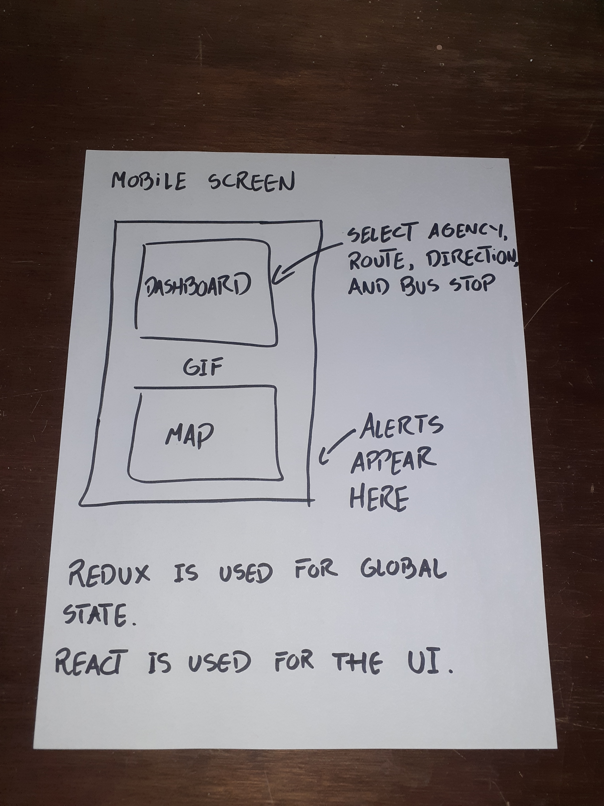

# departure-times-frontend

> This project is under development, it is on a very
> early-stage, and lacks many important features.

The idea behind this application is to render a set of
points in a map that represent a collection of bus stops
in San Francisco together with the position of the
user, then, predictions on the time of departure
on the selected bus stop will be given after
selecting some options on a dashboard.

[The API](https://github.com/santiago-rodrig/departure-times)
is a separate project also built by me.

The data that comes from the API is enough for connecting with
yet another API and create some maps for the user.

The API for creating the maps is [HERE](https://developer.here.com/products/maps).

### Expectation of the result



## Features to be implemented

- The dashboard must trigger the rendering of a map with the bus stations that belong to a direction
- The user must be able to trigger predictions over a bus stop selected beforehand on the dashboard
- There should be GIFs everywhere indicating the state of the applications (fetching, failed, etc.)
- The predictions must be made on every San Francisco's public transport agency, not just one
- The application must look neat and modern
- The application must be responsive and render properly on all screen sizes
- There are no tests

That's everything I can think off by now, feel free to suggest more requirements using
the [issues section of the repository](https://github.com/santiago-rodrig/departure-times-frontend/issues).

## Setup

To setup this project in you local environment (Unix systems) follow these steps.

Make sure that you have the necessary tools.

- [Node](https://nodejs.org/en/) (~> v14.5.0)
- [Yarn](https://yarnpkg.com/getting-started/install) (~> 1.22.4)

Clone the repository.

```sh
git clone https://github.com/santiago-rodrig/departure-times-frontend.git
```

Of course, if your intention is to collaborate, fork the repository instead.

Now, install the required dependencies.

```sh
yarn install --check-files
```

And you should be good to go, read the file `package.json` to know what tasks
can you run on this project, to start the local web server use `yarn run start`.

## Collaboration

To collaborate to this project first fork the repository, after that, create a new branch based
on [develop](https://github.com/santiago-rodrig/departure-times-frontend/tree/develop)
(using [Git-flow](https://nvie.com/posts/a-successful-git-branching-model/)
is recommended), push your branch to your forked repository and create a PR (Pull Request)
from your branch to the develop branch of the original repository.

## License

Specify the license. You can [read the license here](./LICENSE).

### Advanced Configuration

This section has moved here: https://facebook.github.io/create-react-app/docs/advanced-configuration

### Deployment

This section has moved here: https://facebook.github.io/create-react-app/docs/deployment

### `yarn build` fails to minify

This section has moved here: https://facebook.github.io/create-react-app/docs/troubleshooting#npm-run-build-fails-to-minify
